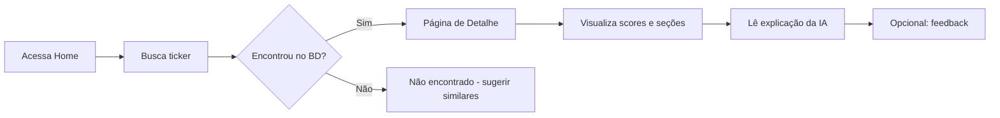
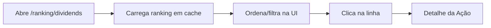
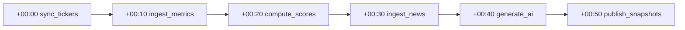
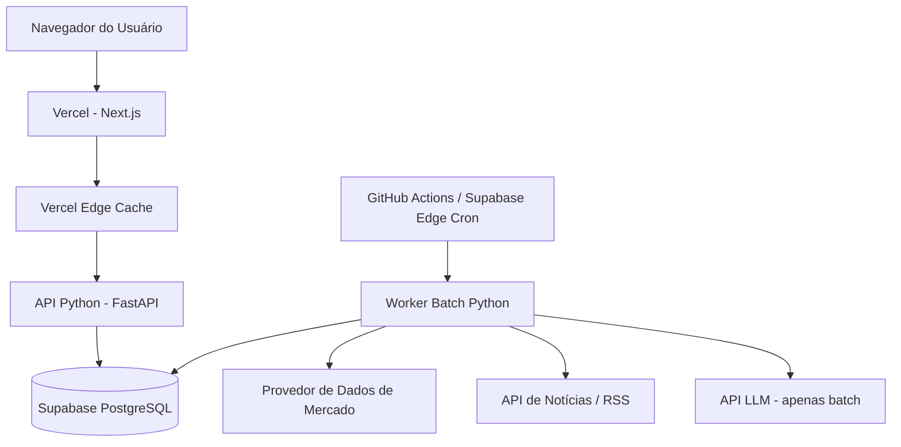

# Documento de Requisitos do Produto (PRD)
# Plataforma de Análise de Ações — Assistida por IA, Orientada por Scores

| Campo | Valor |
|-------|-------|
| **Versão** | 1.0 |
| **Status** | Rascunho |
| **Última atualização** | 19/05/2026 |
| **Responsável** | Produto / Engenharia |

---

## Índice

1. [Visão do Produto](#1-visão-do-produto)
2. [Problema](#2-problema)
3. [Objetivos e Métricas de Sucesso](#3-objetivos-e-métricas-de-sucesso)
4. [Personas](#4-personas)
5. [Escopo e Fora de Escopo](#5-escopo-e-fora-de-escopo)
6. [Funcionalidades](#6-funcionalidades)
7. [Fluxos do Usuário](#7-fluxos-do-usuário)
8. [Regras de Negócio](#8-regras-de-negócio)
9. [Arquitetura de Alto Nível](#9-arquitetura-de-alto-nível)
10. [Requisitos Funcionais](#10-requisitos-funcionais)
11. [Requisitos Não Funcionais](#11-requisitos-não-funcionais)
12. [Estratégia de Baixo Custo Operacional](#12-estratégia-de-baixo-custo-operacional)
13. [Estrutura Inicial dos Módulos](#13-estrutura-inicial-dos-módulos)
14. [Roadmap MVP](#14-roadmap-mvp)
15. [Evoluções Futuras](#15-evoluções-futuras)
16. [Riscos Técnicos e Mitigações](#16-riscos-técnicos-e-mitigações)
17. [Conformidade e Avisos Legais](#17-conformidade-e-avisos-legais)
18. [Questões em Aberto](#18-questões-em-aberto)

---

## 1. Visão do Produto

### 1.1 Declaração de Visão

Construir uma plataforma web **rápida, acessível e confiável** na qual investidores pessoa física brasileiros possam buscar qualquer ação listada e receber uma **análise pré-calculada baseada em scores** — fundamentalista, de dividendos e técnica simples — com uma camada de IA que **explica** a matemática, nunca inventa a recomendação.

### 1.2 Proposta de Valor

| Para o usuário | Para o negócio |
|----------------|----------------|
| Análise instantânea, sem esperar IA em tempo real | Custo de infra previsível via processamento em lote |
| Comprar / manter / vender transparente, com regras determinísticas | Arquitetura escalável, orientada a leitura |
| Ranking diário focado em dividendos | Gasto mínimo com LLM em tempo real |
| Explicações em linguagem simples dos scores | Deploy na Vercel + Supabase (gerenciado, baixa operação) |

### 1.3 Princípios do Produto

1. **A matemática decide; a IA explica** — Recomendações vêm de scores ponderados, não do LLM.
2. **Processa de madrugada, serve de dia** — Pipeline em slots de 10 min (02:00–~02:50 BRT); janela com buffer até 06:00.
3. **Cache em tudo que é leitura** — Requisições do usuário vão ao PostgreSQL (e CDN), não a APIs externas.
4. **Degradação graciosa** — Dados desatualizados são rotulados; dados ausentes não bloqueiam a página.
5. **Baixo custo é feature** — Toda decisão de design é avaliada contra o burn mensal.

---

## 2. Problema

Investidores de varejo não têm um lugar único que combine:

- Métricas fundamentalistas e de dividendos estruturadas
- Uma visão técnica simples
- Uma recomendação clara com **racional auditável**
- Notícias curadas, sem sobrecarga de informação

Ferramentas existentes são terminais caros, chatbots lentos do tipo “pergunte qualquer coisa à IA” (alta latência + risco de alucinação) ou screeners estáticos sem contexto narrativo.

**Nossa abordagem:** Pré-calcular scores durante a madrugada, armazenar resultados no PostgreSQL e usar IA apenas para gerar resumos legíveis a partir de JSON estruturado — nunca para alterar scores ou recomendações.

---

## 3. Objetivos e Métricas de Sucesso

### 3.1 Objetivos de Negócio (MVP)

- Lançar o MVP em **12 semanas** com custo de infra + APIs ≤ **US$ 150/mês** com 1k DAU
- Suportar **ações listadas na B3** (Brasil) como universo principal; arquitetura preparada para tickers dos EUA depois
- Atingir **p95 de carregamento da página de detalhe < 2s** (com cache)

### 3.2 Métricas de Sucesso

| Métrica | Meta (MVP) | Medição |
|---------|------------|---------|
| TTFB da página de detalhe | < 500ms | Vercel Analytics |
| Conversão busca → detalhe | > 40% | Analytics de produto |
| Usuários ativos diários (DAU) | 500 no mês 3 | PostHog / Plausible |
| Taxa de sucesso dos jobs batch | > 99% | Logs / alertas |
| Custo de LLM por sessão | < US$ 0,002 | Contabilização de tokens |
| Utilidade da explicação da recomendação | > 70% positivos | Feedback in-app |

---

## 4. Personas

### 4.1 Primária — “Investidora de Dividendos” (Ana, 38)

- **Perfil:** Profissional de TI, investe R$ 2–5 mil/mês na B3
- **Objetivos:** Encontrar pagadoras estáveis de dividendos, entender segurança do payout, comparar ações rapidamente
- **Dor:** Planilhas são trabalhosas; chatbots genéricos de IA parecem pouco confiáveis
- **Comportamento:** Consulta o ranking toda manhã; aprofunda 2–3 tickers por semana
- **Sucesso:** Vê o ranking + comprar/manter/vender claro com o “porquê” em português simples

### 4.2 Secundária — “Triador Fundamentalista” (Carlos, 45)

- **Perfil:** Investidor experiente, lê balanços ocasionalmente
- **Objetivos:** P/L, ROE, índices de endividamento, comparação setorial
- **Dor:** Dados espalhados entre CVM, Status Invest, planilhas
- **Comportamento:** Usa busca + indicadores; às vezes ignora o ranking
- **Sucesso:** Confia nos números; exporta ou tira print para anotações

### 4.3 Terciária — “Iniciante Curiosa” (Júlia, 26)

- **Perfil:** Nova no investimento, aprendendo terminologia
- **Objetivos:** Entender o que a empresa faz e os principais riscos
- **Dor:** Sobrecarregada por jargão
- **Comportamento:** Lê primeiro o resumo da empresa e a explicação da IA
- **Sucesso:** Se sente informada, não aconselhada — avisos legais claros

---

## 5. Escopo e Fora de Escopo

### 5.1 No Escopo (MVP)

- Busca de ações (ticker, nome da empresa)
- Página de detalhe com todas as seções de análise (pré-calculadas)
- Badge Comprar / Manter / Vender do motor de scores
- Narrativa gerada por IA **a partir de payload de scores congelado**
- Ranking diário de dividendos (top N, ex.: 20)
- Autenticação opcional no MVP (leitura anônima OK; watchlist = Fase 2)

### 5.2 Fora de Escopo (MVP)

- Cotações em tempo real / gráficos intraday
- Acompanhamento de carteira e relatórios fiscais
- Integração com corretoras e execução de ordens
- Apps nativos mobile
- Admin multi-usuário / CMS
- Lógica de recomendação dirigida por LLM
- Alertas personalizados (e-mail/push) — Fase 2

---

## 6. Funcionalidades

### 6.1 Mapa de Funcionalidades

```
┌─────────────────────────────────────────────────────────────────┐
│              PLATAFORMA DE ANÁLISE DE AÇÕES                      │
├─────────────────┬─────────────────┬─────────────────────────────┤
│ Busca e Navegação│ Análise da Ação │ Ranking de Dividendos      │
├─────────────────┼─────────────────┼─────────────────────────────┤
│ Busca por ticker│ Fundamentalista │ Top 20 diário               │
│ Autocomplete    │ Dividendos      │ Colunas ordenáveis          │
│ Buscas recentes │ Técnica (simples)│ Filtro: setor (Fase 2)     │
│                 │ Indicadores     │                             │
│                 │ Resumo empresa  │                             │
│                 │ Riscos          │                             │
│                 │ Notícias        │                             │
│                 │ Recomendação    │                             │
│                 │ Explicação IA   │                             │
└─────────────────┴─────────────────┴─────────────────────────────┘
```

### 6.2 Descrição das Funcionalidades

#### F1 — Busca de Ações
- Autocomplete por ticker e nome da empresa (índice local no banco)
- Buscas recentes em `localStorage` (sem auth no MVP)
- Redirecionamento para `/stock/[ticker]`

#### F2 — Análise Fundamentalista
- Seção pré-calculada: valuation, rentabilidade, crescimento, alavancagem
- Métricas: P/L, P/VP, ROE, ROA, margens, crescimento de EPS, etc.
- Cada métrica tem valor bruto, percentil setorial e sub-score

#### F3 — Análise de Dividendos
- Dividend yield (12m), payout, consistência (anos pagando), CAGR
- Score de segurança do dividendo (payout vs FCF, contexto de dívida)
- Calendário de ex-dividendo e pagamento (próximos 12 meses, se disponível)

#### F4 — Análise Técnica Simples
- **Não** é terminal de trading: rótulo de tendência (alta / neutra / baixa)
- Indicadores: estado do cruzamento SMA 20/50/200, zona do RSI(14), posição nas 52 semanas
- Sub-score técnico alimenta o score geral (peso baixo vs fundamental + dividendos)

#### F5 — Painel de Indicadores Financeiros
- KPIs tabulares com sparkline (últimos 8 trimestres) quando houver dados
- Codificação por cor: verde / amarelo / vermelho vs mediana setorial

#### F6 — Resumo da Empresa
- Fatos estáticos: setor, segmento, segmento de listagem, market cap, funcionários
- Narrativa IA (batch): “o que a empresa faz” a partir do equivalente 10-K/20-F + resumo do site (máx. 150 palavras)

#### F7 — Riscos
- Flags de risco baseadas em regras (ex.: dívida alta, receita em queda, eventos de governança)
- Narrativa IA expande **apenas flags existentes** — não pode adicionar riscos ausentes no JSON

#### F8 — Notícias Relevantes
- Top 5 artigos (últimos 7 dias), deduplicados, fonte + data + manchete
- Resumo IA opcional de 1 linha por artigo (batch) — sem fetch ao vivo na requisição do usuário

#### F9 — Recomendação (Comprar / Manter / Vender)
- **Determinística** a partir do score composto (ver Regras de Negócio)
- Exibição: badge, gráfico de breakdown do score, faixa de confiança
- Bloco IA: “Por que esta recomendação” — deve citar componentes do score

#### F10 — Ranking Diário de Dividendos
- Atualizado após o batch noturno
- Fórmula do ranking: score de dividendos ponderado (ver §8.3)
- Colunas: posição, ticker, nome, yield, score de segurança, recomendação, variação vs ontem

---

## 7. Fluxos do Usuário

### 7.1 Fluxo Principal — Analisar uma Ação



**Passos:**
1. Usuário acessa a home → vê barra de busca + preview do ranking de dividendos do dia (top 5).
2. Usuário digita `ITUB4` → autocomplete → Enter.
3. Frontend `GET /api/v1/stocks/ITUB4` → retorna JSON pré-calculado do PostgreSQL (< 300ms).
4. Página renderiza: badge de recomendação, breakdown do score, abas/seções.
5. Explicação da IA carregada da coluna `ai_explanation` (pré-gerada); se ausente, exibe template só com scores (sem LLM ao vivo no caminho crítico do MVP).

### 7.2 Fluxo Secundário — Ranking Matinal de Dividendos



### 7.3 Fluxo Batch — Pipeline Noturno (Sistema)

Slots de **~10 min** a partir de `T0` (produção: **02:00 BRT**):



| Offset | BRT | Etapa |
|--------|-----|-------|
| +00:00 | 02:00 | Buscar / atualizar tickers |
| +00:10 | 02:10 | Atualizar métricas (mercado + fundamentos) |
| +00:20 | 02:20 | Calcular scores e recomendação |
| +00:30 | 02:30 | Buscar notícias (+ sentiment por regras) |
| +00:40 | 02:40 | Gerar análises IA (batch) |
| +00:50 | 02:50 | Salvar snapshots, ranking e invalidar cache |

---

## 8. Regras de Negócio

### 8.1 A Recomendação Nunca É Decidida pela IA

| ID | Regra |
|----|-------|
| RN-01 | `recommendation` enum ∈ {`BUY`, `HOLD`, `SELL`} é calculado apenas pelo `RecommendationEngine` |
| RN-02 | O LLM recebe JSON `score_breakdown` como entrada; a saída não pode alterar scores |
| RN-03 | Validação pós-LLM: se a narrativa contradiz a recomendação → descarta narrativa, usa template |
| RN-04 | A UI sempre exibe “Recomendação baseada em modelo quantitativo — não é recomendação de investimento” |

### 8.2 Modelo de Scoring (MVP)

**Score composto (0–100):**

```
composite = 0.45 * fundamental_score
          + 0.35 * dividend_score
          + 0.20 * technical_score
```

**Limiares de recomendação:**

| Score Composto | Recomendação |
|----------------|--------------|
| ≥ 70 | BUY (Comprar) |
| 45 – 69 | HOLD (Manter) |
| < 45 | SELL (Vender) |

Limiares configuráveis na tabela `scoring_config` sem deploy de código.

**Regras de sub-score (exemplos):**

- **Fundamentalista:** média ponderada de métricas normalizadas (ROE, ROA, P/L vs setor, dívida/EBITDA, CAGR de receita)
- **Dividendos:** score de yield (com teto), segurança do payout, anos consecutivos pagando, CAGR de dividendos
- **Técnico:** alinhamento de médias móveis, faixa neutra RSI 30–70, preço vs faixa de 52 semanas

Métrica ausente → excluir do denominador do sub-score; se < 50% das métricas disponíveis → sub-score = `null`, composto renormaliza os pesos.

### 8.3 Fórmula do Ranking de Dividendos

```
dividend_rank_score = 0.50 * dividend_score
                    + 0.30 * fundamental_score
                    + 0.20 * dividend_safety_score
```

- Universo: ações B3 com market cap > R$ 1 bi e volume médio diário > limiar
- Excluir: ações com `recommendation = SELL` e `dividend_score < 40` (configurável)
- Desempate: maior segurança do dividendo, depois maior market cap

### 8.4 Atualidade dos Dados

| Tipo de dado | Atraso máximo | Rótulo na UI |
|--------------|---------------|--------------|
| Preços / técnico | 1 dia útil | “Atualizado em: DD/MM/AAAA” |
| Fundamentos | 1 trimestre + 7 dias após resultados | “Fundamentos: Qx AAAA” |
| Notícias | Janela rolante de 7 dias | “Notícias até DD/MM” |
| Texto IA | Regenerado quando score muda > 5 pts | “Análise atualizada diariamente” |

### 8.5 Restrições de Uso da IA

| Contexto | Permitido | Proibido |
|----------|-----------|----------|
| Explicação em batch | Parafrasear scores, resumir empresa | Inventar métricas, mudar recomendação |
| Resumo de notícias em batch | Encurtar artigo | Adicionar fatos não presentes no artigo |
| Requisição do usuário (MVP) | **Nenhum** — sem LLM ao vivo | Chat em tempo real |

---

## 9. Arquitetura de Alto Nível

### 9.1 Contexto do Sistema



### 9.2 Topologia de Deploy

| Componente | Plataforma | Observações |
|------------|------------|-------------|
| Frontend (Next.js 14+ App Router) | **Vercel** | SSR/ISR para ranking; estático onde possível |
| API (FastAPI) | **Vercel Serverless** ou **Railway/Fly** free tier | Se Vercel limitar Python, API no Fly + proxy Vercel |
| PostgreSQL | **Supabase** | Row Level Security para auth futuro |
| Jobs batch | **GitHub Actions** cron agendado | Free tier: 2k min/mês; jobs pesados divididos |
| Arquivos/cache | Supabase Storage (opcional) | Arquivos JSON para auditoria |
| Secrets | Vercel + GitHub env criptografado | Chaves de API nunca no frontend |

> **Nota:** A Vercel suporta Next.js nativamente; FastAPI em Python pode rodar como serverless com limites de tamanho. Alternativa: Route Handlers do Next.js com RPC Supabase para leituras; worker Python só para batch. Ver §12.

### 9.3 Fluxo de Dados (Caminho de Leitura)

1. Usuário acessa `/stock/ITUB4`
2. Página ISR do Next.js ou fetch no cliente → `GET /api/v1/stocks/ITUB4`
3. API lê `stock_analysis_snapshot` (linha materializada por ticker por dia)
4. JSON de resposta → renderiza componentes; texto da IA é campo string, sem streaming

### 9.4 Fluxo de Dados (Caminho de Escrita — Apenas Batch)

1. Cron dispara `batch_runner.py` às 02:00 BRT
2. Ingestão → tabelas staging → validação → cálculo de scores → LLM opcional → upsert de snapshots
3. Tabela `ranking_dividends_daily` substituída atomicamente (transação)
4. Webhook ou tag invalida chaves de cache da Vercel

### 9.5 Stack Tecnológica

| Camada | Tecnologia |
|--------|------------|
| Frontend | Next.js 14+, TypeScript, Tailwind CSS, shadcn/ui |
| API | Python 3.12+, FastAPI, Pydantic v2 |
| ORM | SQLAlchemy 2.0 ou asyncpg direto em hot paths |
| Banco de dados | PostgreSQL 15+ (Supabase) |
| Migrações | Alembic |
| Batch | Scripts Python + GitHub Actions |
| LLM | OpenAI GPT-4o-mini / Gemini Flash (batch, modo JSON) |
| Observabilidade | Sentry (erros), logs estruturados, endpoint de health simples |

---

## 10. Requisitos Funcionais

### 10.1 Endpoints da API (MVP)

| ID | Método | Caminho | Descrição |
|----|--------|---------|-----------|
| RF-API-01 | GET | `/api/v1/stocks/search?q=` | Autocomplete de tickers |
| RF-API-02 | GET | `/api/v1/stocks/{ticker}` | Snapshot completo da análise |
| RF-API-03 | GET | `/api/v1/rankings/dividends?date=` | Ranking diário (padrão: hoje) |
| RF-API-04 | GET | `/api/v1/health` | Health check |
| RF-API-05 | POST | `/api/v1/feedback` | Positivo/negativo na explicação (opcional) |

### 10.2 Páginas do Frontend

| ID | Rota | Descrição |
|----|------|-----------|
| RF-UI-01 | `/` | Home: busca + preview do ranking |
| RF-UI-02 | `/stock/[ticker]` | Detalhe da ação |
| RF-UI-03 | `/ranking/dividends` | Ranking completo de dividendos |
| RF-UI-04 | `/about` | Avisos legais, metodologia |

### 10.3 Jobs Batch

| ID | Job | Offset / BRT | Descrição |
|----|-----|--------------|-----------|
| RF-BATCH-01 | `sync_tickers` | +00:00 / 02:00 | Atualizar universo de tickers B3 |
| RF-BATCH-02 | `ingest_metrics` | +00:10 / 02:10 | Preços, volume e fundamentos → métricas |
| RF-BATCH-03 | `compute_scores` | +00:20 / 02:20 | Sub-scores, composto e recomendação |
| RF-BATCH-04 | `ingest_news` | +00:30 / 02:30 | Notícias (7d) + sentiment por regras |
| RF-BATCH-05 | `generate_ai_narratives` | +00:40 / 02:40 | Textos IA (batch, validados) |
| RF-BATCH-06 | `publish_snapshots` | +00:50 / 02:50 | Snapshot, ranking, purge de cache |
| RF-BATCH-07 | `weekly_full_refresh` | Dom 01:00 | Backfill e percentis setoriais |

### 10.4 Entidades do Banco (Core)

| Tabela | Propósito |
|--------|-----------|
| `stocks` | Mestre: ticker, nome, setor, ISIN |
| `stock_metrics_daily` | Métricas brutas/normalizadas por data |
| `stock_scores_daily` | Sub-scores + composto + recomendação |
| `stock_analysis_snapshot` | Modelo de leitura desnormalizado para API |
| `stock_news` | Artigos vinculados ao ticker |
| `ranking_dividends_daily` | Lista ordenada por data |
| `scoring_config` | Limiares e pesos (versionados) |
| `batch_job_runs` | Auditoria: status, duração, linhas afetadas |
| `ai_narratives` | Texto gerado + hash do prompt + versão do modelo |

### 10.5 Critérios de Aceite (MVP)

- [ ] Busca retorna resultados em < 200ms para 95% das consultas (indexado)
- [ ] Detalhe da ação carrega snapshot completo sem chamar APIs externas
- [ ] Recomendação coincide com saída do `RecommendationEngine` em 100% dos fixtures de teste
- [ ] Explicação da IA referencia pelo menos 3 componentes do score do JSON
- [ ] Página de ranking exibe dados consistentes com sucesso de `batch_job_runs` do dia
- [ ] Dados desatualizados exibem timestamp visível
- [ ] Site funciona com JavaScript desabilitado no ranking (SSR)

---

## 11. Requisitos Não Funcionais

### 11.1 Performance

| ID | Requisito |
|----|-----------|
| RNF-P01 | Latência p95 da API < 300ms para leitura de snapshot |
| RNF-P02 | LCP < 2,5s em 4G na página de detalhe |
| RNF-P03 | Ranking com 20 linhas iniciais; paginação na Fase 2 |
| RNF-P04 | Pipeline batch conclui em janela de 4 horas |

### 11.2 Escalabilidade

| ID | Requisito |
|----|-----------|
| RNF-S01 | Suportar 500 tickers no MVP → 3.000 sem mudança de arquitetura |
| RNF-S02 | Read replicas via Supabase quando conexões > 80% |
| RNF-S03 | Tabela snapshot com leitura O(1) por ticker + data |

### 11.3 Disponibilidade

| ID | Requisito |
|----|-----------|
| RNF-A01 | 99,5% de uptime da API de leitura (MVP) |
| RNF-A02 | Modo degradado: exibir último snapshot bem-sucedido se o batch falhar |

### 11.4 Segurança

| ID | Requisito |
|----|-----------|
| RNF-SEC01 | Sem chaves de API nos bundles do cliente |
| RNF-SEC02 | Rate limit: 60 req/min/IP na busca |
| RNF-SEC03 | RLS do Supabase habilitado antes de features multi-tenant |
| RNF-SEC04 | Validação de ticker (regex: `^[A-Z]{4}\d{1,2}$`) |

### 11.5 Custo

| ID | Requisito |
|----|-----------|
| RNF-C01 | Gasto com LLM < US$ 50/mês na escala do MVP |
| RNF-C02 | Um único provedor de dados de mercado; sem feeds redundantes |
| RNF-C03 | Narrativas IA regeneradas apenas em mudança material de score |

### 11.6 Manutenibilidade

| ID | Requisito |
|----|-----------|
| RNF-M01 | Versão do scoring fixada em cada snapshot (`scoring_config_version`) |
| RNF-M02 | Jobs batch idempotentes (seguros para reexecutar) |
| RNF-M03 | 80% de cobertura de testes unitários no motor de scoring |

---

## 12. Estratégia de Baixo Custo Operacional

### 12.1 Drivers de Custo e Controles

| Driver | Mitigação |
|--------|-----------|
| Tokens LLM | Apenas batch; GPT-4o-mini; ~500 tokens/ação; pular scores inalterados |
| API de dados de mercado | Um provedor; cache de respostas brutas 24h; fundamentos semanalmente |
| Computação | Cron GitHub Actions (free tier); sem workers 24/7 |
| Banco de dados | Supabase free → Pro só quando conexões/armazenamento exigirem |
| Frontend | Vercel hobby → Pro quando bandwidth exceder |
| Egress | Snapshots desnormalizados = 1 query/página |

### 12.2 Estimativa de Custo de IA (MVP)

Premissas: 400 ações, 30% de mudança de score/dia → 120 chamadas LLM/noite × 800 tokens ≈ 96k tokens/dia ≈ **~US$ 1–3/mês** em modelos mini.

Refresh semanal de narrativas do universo completo: +US$ 5–10/mês.

### 12.3 Otimização de Custo na Arquitetura

1. **Padrão read model** — `stock_analysis_snapshot` evita JOINs na requisição
2. **ISR / CDN** — Página de ranking revalida uma vez por dia (`revalidate: 86400`)
3. **Sem WebSockets** — Sem infra em tempo real
4. **Connection pooling Supabase** — PgBouncer modo transaction
5. **Opcional: remover FastAPI no caminho de leitura** — Server Components do Next.js consultam Supabase via service role (somente servidor); Python reservado para batch

### 12.4 Divisão de Hosting Recomendada para o MVP (Menor Custo)

| Carga de trabalho | Host |
|-------------------|------|
| UI Next.js + BFF de leitura | Vercel |
| PostgreSQL | Supabase Free |
| Batch Python | GitHub Actions (agendado) |
| FastAPI (se necessário) | Fly.io free allowance ou Vercel Python |

---

## 13. Estrutura Inicial dos Módulos

### 13.1 Layout do Monorepo

```
stock-analysis-app/
├── frontend/                         # Next.js 15 + TypeScript
│   ├── app/
│   │   ├── page.tsx                  # Home
│   │   ├── stock/[ticker]/page.tsx
│   │   └── ranking/dividends/page.tsx
│   ├── components/
│   │   ├── search/
│   │   ├── stock/                    # Seções de análise
│   │   └── ranking/
│   └── lib/
│       └── api-client.ts
├── backend/
│   ├── api/                          # FastAPI (API de leitura)
│   │   ├── app/
│   │   │   ├── main.py
│   │   │   ├── routers/
│   │   │   │   ├── stocks.py
│   │   │   │   └── rankings.py
│   │   │   └── deps.py
│   │   └── pyproject.toml
│   ├── core/                         # Domínio Python compartilhado
│   │   ├── scoring/
│   │   │   ├── fundamental.py
│   │   │   ├── dividend.py
│   │   │   ├── technical.py
│   │   │   ├── composite.py
│   │   │   └── recommendation.py     # BUY/HOLD/SELL apenas aqui
│   │   ├── ingestion/
│   │   │   ├── market_data.py
│   │   │   ├── fundamentals.py
│   │   │   └── news.py
│   │   ├── ai/
│   │   │   ├── prompts/
│   │   │   ├── narrative_generator.py
│   │   │   └── validators.py         # Garante que scores não mudem
│   │   └── models/
│   │       └── schemas.py
│   ├── batch/                        # Pipeline noturno (+00:00 → +00:50)
│   │   ├── sync_tickers.py           # 00:00
│   │   ├── ingest_metrics.py         # 00:10
│   │   ├── compute_scores.py         # 00:20
│   │   ├── ingest_news.py            # 00:30
│   │   ├── generate_ai_narratives.py # 00:40
│   │   └── publish_snapshots.py      # 00:50
│   └── db/
│       ├── migrations/               # Alembic
│       └── seeds/
├── docs/
│   └── prd.md
├── .github/
│   └── workflows/
│       └── nightly-batch.yml
└── docker-compose.yml                # Postgres local apenas
```

### 13.2 Responsabilidades dos Módulos

| Módulo | Responsabilidade |
|--------|------------------|
| `backend/core/scoring` | Funções puras, testadas, sem I/O |
| `backend/core/ingestion` | Adaptadores de APIs externas, rate limits |
| `backend/core/ai` | Templates de prompt + validação de saída |
| `backend/batch` | Entrypoints CLI, orquestração, retries |
| `backend/api` | Camada fina de leitura sobre snapshots |
| `frontend` | Apenas apresentação; sem regra de negócio |

### 13.3 Interfaces Principais

```python
# backend/core/scoring/recommendation.py
def compute_recommendation(composite_score: float, config: ScoringConfig) -> Recommendation:
    ...

# backend/core/ai/narrative_generator.py
def build_explanation(score_payload: ScorePayload) -> str:
    """Chamada LLM — entrada são apenas scores, saída validada."""
    ...
```

```typescript
// frontend/lib/api-client.ts
export async function getStockSnapshot(ticker: string): Promise<StockSnapshot> { ... }
```

---

## 14. Roadmap MVP

### Fase 0 — Fundação (Semanas 1–2)

| Entregável | Responsável |
|------------|-------------|
| Scaffold do monorepo, CI lint/test | Eng |
| Projeto Supabase + schema core | Eng |
| Motor de scoring v0 + testes unitários | Eng |
| Gerador de dados mock para 10 tickers | Eng |

### Fase 1 — Pipeline de Dados (Semanas 3–5)

| Entregável | Responsável |
|------------|-------------|
| Ingestão de mercado + fundamentos (1 provedor) | Eng |
| Batch noturno no GitHub Actions | Eng |
| Publicação de snapshot + monitoramento de jobs | Eng |
| Universo de 50 ações | Eng |

### Fase 2 — API e Frontend (Semanas 6–9)

| Entregável | Responsável |
|------------|-------------|
| Busca de ações + página de detalhe | Eng |
| Página de ranking de dividendos | Eng |
| UI de recomendação + gráfico de breakdown | Eng |
| SSR/ISR + avisos legais | Eng |

### Fase 3 — Narrativas IA e Polimento (Semanas 10–12)

| Entregável | Responsável |
|------------|-------------|
| Explicações IA em batch com validação | Eng |
| Ingestão e exibição de notícias | Eng |
| Widget de feedback | Produto |
| Expandir para 200+ tickers | Eng |
| Lançamento beta | Produto |

### Definição de Pronto do MVP

- [ ] 200 ações B3 com análise diária atualizada
- [ ] Ranking de dividendos disponível até 07:00 BRT
- [ ] Documentação: página de metodologia
- [ ] Aviso legal revisado
- [ ] Alerta de erro em falha do batch

---

## 15. Evoluções Futuras

| Fase | Funcionalidade | Valor |
|------|----------------|-------|
| v1.1 | Auth + watchlist (Supabase Auth) | Retenção |
| v1.2 | Filtros por setor no ranking | Descoberta |
| v1.3 | Ações EUA (NYSE/NASDAQ) | Expansão de mercado |
| v1.4 | Gráficos históricos de score | Análise de tendência |
| v1.5 | Digest por e-mail do ranking | Engajamento |
| v2.0 | Importação de carteira (CSV) | Personalização |
| v2.1 | Comparar 2–4 ações lado a lado | Apoio à decisão |
| v2.2 | Backtest de estratégia de dividendos | Usuários avançados |
| v3.0 | Tier premium: mais tickers, export PDF | Monetização |

**Explicitamente adiado:** Chat IA ao vivo, robo-advisor, execução de ordens.

---

## 16. Riscos Técnicos e Mitigações

| Risco | Impacto | Probabilidade | Mitigação |
|-------|---------|---------------|-----------|
| Custo/limite da API de dados de mercado | Alto | Média | Cache agressivo; começar com 200 ações líquidas |
| Limites da Vercel para Python/FastAPI | Médio | Média | Leitura via Next.js + Supabase; Python só em batch |
| Alucinação do LLM nas narrativas | Alto | Média | Validação de schema; fallback em template; citar só scores |
| Batch estourar janela (> 6h) | Médio | Baixa | Paralelizar por setor; updates incrementais |
| Lógica incorreta de recomendação | Alto | Baixa | Golden tests; painel de revisão manual pré-lançamento |
| Limites do tier free do Supabase | Médio | Média | Monitorar conexões; arquivar notícias antigas |
| Percepção regulatória (recomendação de investimento) | Alto | Média | Avisos em destaque; posicionamento como “ferramenta educacional” |
| Lacunas de qualidade em small caps | Médio | Alta | Filtro mínimo de liquidez; exibir % de cobertura de dados |

---

## 17. Conformidade e Avisos Legais

### 17.1 Textos Obrigatórios na UI (MVP)

- “Esta plataforma fornece informações educacionais baseadas em modelos quantitativos. **Não** constitui recomendação de investimento.”
- “Desempenho passado não garante resultados futuros.”
- “A recomendação é gerada por um modelo matemático, não por analista humano nem por IA discricionária.”

### 17.2 Atribuição de Dados

- Exibir nome do provedor de dados e timestamp da última atualização
- Notícias: link para fonte original; respeitar robots.txt / ToS da API

### 17.3 LGPD (Brasil)

- MVP anônimo: nenhum dado pessoal coletado
- Fase 2 com auth: política de privacidade, consentimento para e-mail, exportação/exclusão de dados

---

## 18. Questões em Aberto

| # | Questão | Decisão até |
|---|---------|-------------|
| 1 | Provedor principal de dados (Brapi, HG Brasil, Alpha Vantage)? | Semana 1 |
| 2 | API na Vercel Python vs leituras só via Next? | Semana 2 |
| 3 | UI apenas em português no MVP? | Semana 1 |
| 4 | Filtros exatos do universo do ranking de dividendos? | Semana 3 |
| 5 | Modelo de monetização pós-MVP? | Pós-beta |

---

## Apêndice A — Schema do Payload de Score (Entrada da IA)

O LLM recebe **apenas** esta estrutura (exemplo):

```json
{
  "ticker": "ITUB4",
  "as_of": "2026-05-19",
  "composite_score": 72.4,
  "recommendation": "BUY",
  "breakdown": {
    "fundamental": { "score": 75, "highlights": ["ROE acima do setor", "margens estáveis"] },
    "technical": { "score": 68, "highlights": ["SMA50 > SMA200"] },
    "dividend": { "score": 80, "highlights": ["yield 8,2%", "payout estável em 5 anos"] }
  },
  "risks": ["HIGH_DEBT_VS_SECTOR"],
  "scoring_version": "1.0.0"
}
```

Instrução do prompt (imutável): *“Explique a recomendação em português para um investidor de varejo. Não altere a recomendação. Não invente números. Use apenas campos presentes no JSON.”*

---

## Apêndice B — Glossário

| Termo | Definição |
|-------|-----------|
| Snapshot | Linha diária desnormalizada servida à UI |
| Sub-score | Score 0–100 para fundamental, dividendos ou técnico |
| Composto | Combinação ponderada dos sub-scores |
| Janela batch | Núcleo 02:00–02:50 BRT; buffer com retries até 06:00 |

---

*Fim do PRD v1.0*
